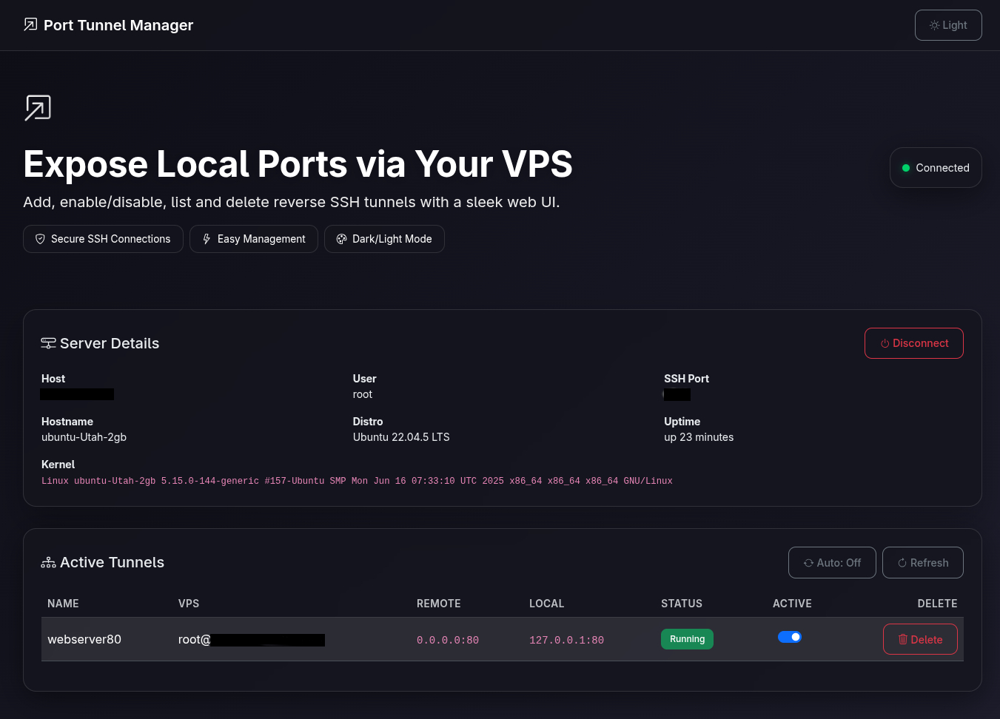

# Port Tunnel

**Port Tunnel** is a lightweight tool for securely exposing local services to a remote VPS using reverse SSH tunnels.  
It comes with both a **modern Web GUI** (FastAPI + Bootstrap + jQuery) and a **command-line interface (CLI)** for easy tunnel management.

## www.porttunnel.org

---

## ✨ Features

- 🔑 **Simple Connection** – Connect to VPS using password or SSH key  
- 🔄 **Reverse SSH Tunnels** – Expose local ports on a VPS without a public IP  
- 🌐 **Web Dashboard** – Manage tunnels visually with a clean Bootstrap UI (dark mode supported)  
- 💻 **CLI Mode** – Add, list, disable, and delete tunnels from the terminal  
- 💾 **Persistence** – Saves connected servers and active tunnels across restarts  
- 🛡 **Auto Monitoring** – Disconnects automatically if server is unreachable for 30s  
- ⚡ **Cross-Platform** – Works on Linux, Windows, and macOS  
- 📦 **Standalone Binary** – Can be bundled with static files into a single executable  

---

## 🚀 Installation

Clone the repo:
```
git clone https://github.com/porttunnel/PortTunnel.git
cd PortTunnel
```
Create a virtual environment and install dependencies:

```
python3 -m venv venv
source venv/bin/activate   # Linux/macOS
venv\Scripts\activate      # Windows
pip install -r requirements.txt
```
Run the app:
```
./main.py --webport 8080
```
Then open in your browser:
```
👉 http://localhost:8080
```


## Method 2: Install as a System Service (Binary Installation)
```
# Clone the repository
git clone https://github.com/porttunnel/PortTunnel.git
cd PortTunnel

# Make the installation script executable and run it
chmod +x install-porttunnel.sh
sudo ./install-porttunnel.sh
```

## PortTunnel - Windows Port Forwarding Tool

You can download the latest version of PortTunnel directly from the link below:

📥 Download <a href="https://github.com/porttunnel/PortTunnel/raw/refs/heads/main/dist/PortTunnel.exe" target="_blank">PortTunnel.exe</a>

To enable the web management interface on port 8080:
cmd

```
PortTunnel.exe --webport 8080
```

Then open your browser and navigate to http://localhost:8080 to access the web interface.

🖥 CLI Usage
```
./main.py [OPTIONS] COMMAND
```
Commands
```
list – Show all tunnels

add NAME REMOTE_PORT LOCAL_PORT – Create a new tunnel

delete NAME – Remove a tunnel

server – Show connected server details
```

Example
```
./main.py add web80 80 8080
./main.py list
./main.py delete web80
```

🌐 Web Interface
Connect to your VPS (password or SSH key)

Manage tunnels in a table view

Toggle active/disabled state for each tunnel

Delete tunnels with one click

See server details (host, distro, SSH port, etc.)

Dark mode UI with Bootstrap

🔧 Persistence
All state (servers + tunnels) is stored in:


~/.config/port_tunnel_manager/state.json
This ensures your tunnels and server info survive restarts.

📦 Building a Standalone Binary
You can package the app (including static files) using PyInstaller:
```
pip install pyinstaller
pyinstaller --onefile --add-data "static:static" main.py
```
This generates a standalone binary under dist/main.

📸 Screenshots


⚖️ License
MIT License – free to use, modify, and distribute.

💡 Tagline
“Port Tunnel – Manage reverse SSH tunnels with ease, via Web UI and CLI.”


